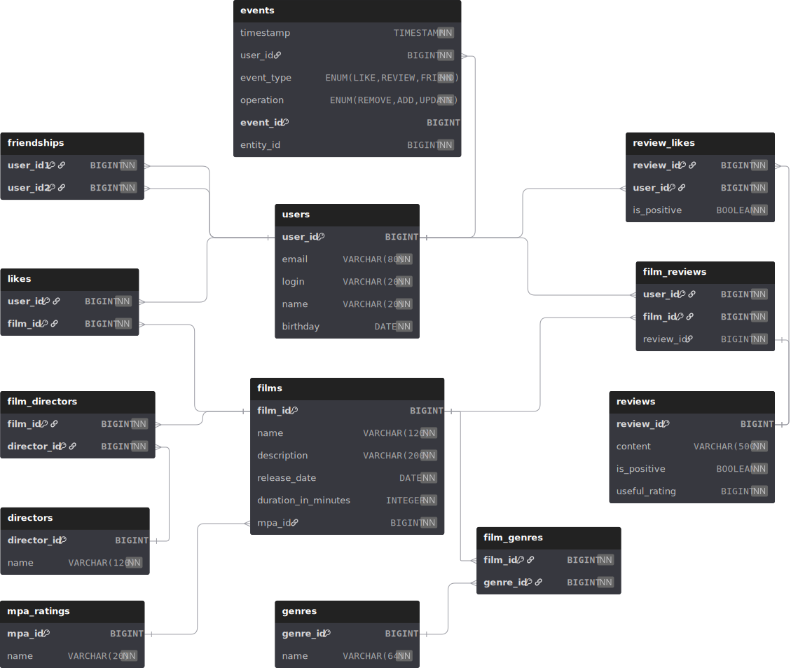

# Java-Filmorate

Repository for filmorate - social network for film rating. Written in java.

# DB schema



## Examples of database queries

### Get all films

```sql
SELECT *
FROM films;
```

### Get all films with mpa rating and genres concatenated as string

```sql
SELECT f.film_id,
       f.name,
       f.description,
       f.release_date,
       f.duration_in_minutes,
       m.name               AS mpa_rating,
       GROUP_CONCAT(g.name) AS genres
FROM films f
         JOIN mpa_ratings m ON f.mpa_id = m.mpa_id
         LEFT JOIN film_genres fg ON f.film_id = fg.film_id
         LEFT JOIN genres g ON fg.genre_id = g.genre_id
GROUP BY f.film_id, f.name, f.description, f.release_date, f.duration_in_minutes, m.name
ORDER BY f.film_id;
```

### Get top 10 films by likes amount

```sql
SELECT f.film_id,
       f.name,
       f.description,
       f.release_date,
       f.duration_in_minutes,
       f.mpa_id
FROM films f
         LEFT JOIN likes fl ON f.film_id = fl.film_id
GROUP BY f.film_id, f.name, f.description, f.release_date, f.duration_in_minutes
ORDER BY COUNT(fl.user_id) DESC, f.film_id 
LIMIT 10;
```

### Get all users

```sql
SELECT *
FROM users;
```

### Get all friends of a user with id 1

```sql
SELECT u.user_id,
       u.login,
       u.name,
       u.email
FROM users u
WHERE u.user_id IN (SELECT f.user_id2
                    FROM friendships f
                    WHERE f.user_id1 = 1)
ORDER BY u.name;
```

### Get all common friends between users with id 1 and 2

```sql
SELECT u.user_id,
       u.login,
       u.name,
       u.email
FROM users u
WHERE u.user_id IN (SELECT user_id2
                    FROM friendships
                    WHERE user_id1 = 1

                    INTERSECT

                    SELECT user_id2
                    FROM friendships
                    WHERE user_id1 = 2
```
